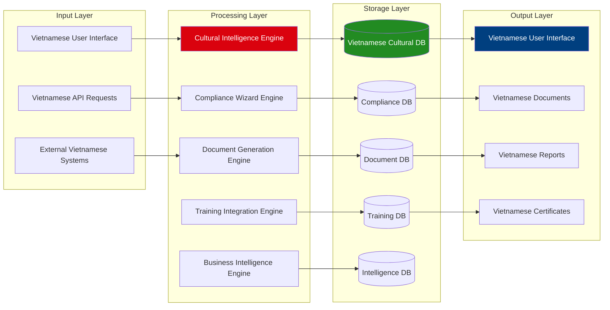
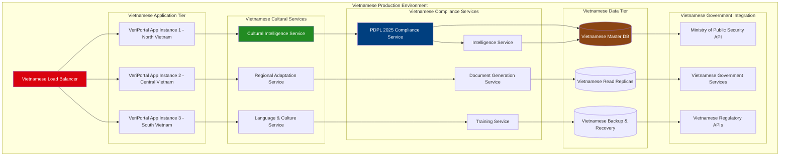

# VeriPortal System Architecture Diagram
## Vietnamese Cultural Intelligence DPO Compliance Platform

```mermaid
graph TB
    subgraph "VeriPortal System Architecture"
        subgraph "Core Foundation Layer"
            VCI[VeriPortal Cultural Intelligence Engine]
            VRA[Vietnamese Regional Adaptation]
            VCL[Vietnamese Cultural Localization]
        end

        subgraph "UI/UX Layer - Module 1: Cultural Interface"
            VCUI[VeriPortal Cultural UI Engine]
            VRG[Vietnamese Regional GUI]
            VCC[Vietnamese Cultural Components]
            VCA[Vietnamese Cultural Animations]
            
            VCUI --> VCI
            VRG --> VRA
            VCC --> VCL
            VCA --> VCI
        end

        subgraph "Business Logic Layer - Module 2: Self-Service DPO"
            VBO[Vietnamese Business Onboarding]
            VCA2[Vietnamese Compliance Assessment]
            VDM[Vietnamese DPO Management]
            VCM[Vietnamese Compliance Monitoring]
            
            VBO --> VCUI
            VCA2 --> VRG
            VDM --> VCC
            VCM --> VCA
        end

        subgraph "Compliance Engine - Module 3: Compliance Wizards"
            VPW[VPDPL 2025 Wizard]
            VGW[Vietnamese GDPR Wizard]
            VLW[Vietnamese Legal Wizard]
            VRW[Vietnamese Regulatory Wizard]
            
            VPW --> VBO
            VGW --> VCA2
            VLW --> VDM
            VRW --> VCM
        end

        subgraph "Document Layer - Module 4: Document Generation"
            VPP[Vietnamese Privacy Policy Generator]
            VDG[Vietnamese Document Generator]
            VTC[Vietnamese Template Controller]
            VVS[Vietnamese Validation System]
            
            VPP --> VPW
            VDG --> VGW
            VTC --> VLW
            VVS --> VRW
        end

        subgraph "Education Layer - Module 5: Training Integration"
            VTP[VPDPL 2025 Training Program]
            VCT[Vietnamese Cultural Training]
            VIT[Vietnamese Interactive Training]
            VCP[Vietnamese Certification Program]
            
            VTP --> VPP
            VCT --> VDG
            VIT --> VTC
            VCP --> VVS
        end

        subgraph "Intelligence Layer - Module 6: Business Intelligence"
            VMI[Vietnamese Market Intelligence]
            VCA3[Vietnamese Competitive Analysis]
            VIB[Vietnamese Industry Benchmarks]
            VCI2[Vietnamese Cultural Insights]
            
            VMI --> VTP
            VCA3 --> VCT
            VIB --> VIT
            VCI2 --> VCP
        end

        subgraph "Data Layer"
            VDB[(Vietnamese Compliance Database)]
            VLD[(Vietnamese Legal Database)]
            VCD[(Vietnamese Cultural Database)]
            VMD[(Vietnamese Market Database)]
            
            VDB --> VBO
            VLD --> VPW
            VCD --> VCI
            VMD --> VMI
        end

        subgraph "Integration Layer"
            VAPI[Vietnamese API Gateway]
            VMS[Vietnamese Microservices]
            VES[Vietnamese Event System]
            VSS[Vietnamese Security System]
            
            VAPI --> VDB
            VMS --> VLD
            VES --> VCD
            VSS --> VMD
        end

        subgraph "External Integration"
            VMPS[Vietnamese Ministry of Public Security API]
            VGS[Vietnamese Government Services]
            VTPS[Vietnamese Third-Party Services]
            VIS[Vietnamese Industry Systems]
            
            VMPS --> VAPI
            VGS --> VMS
            VTPS --> VES
            VIS --> VSS
        end
    end

    %% Regional Adaptation Flow
    subgraph "Vietnamese Regional Adaptations"
        VN[Northern Vietnam - Formal Style]
        VC[Central Vietnam - Balanced Style]
        VS[Southern Vietnam - Dynamic Style]
        
        VN --> VRG
        VC --> VRG
        VS --> VRG
    end

    %% Cultural Intelligence Flow
    subgraph "Vietnamese Cultural Intelligence Features"
        VCC1[Vietnamese Color Psychology]
        VCC2[Vietnamese Typography]
        VCC3[Vietnamese Symbols & Motifs]
        VCC4[Vietnamese Business Hierarchy]
        VCC5[Vietnamese Communication Patterns]
        
        VCC1 --> VCUI
        VCC2 --> VCUI
        VCC3 --> VCA
        VCC4 --> VBO
        VCC5 --> VCT
    end

    %% Legal Compliance Flow
    subgraph "Vietnamese Legal Compliance Framework"
        VPDPL[Vietnamese PDPL 2025]
        VGDPR[Vietnamese GDPR Implementation]
        VLC[Vietnamese Local Regulations]
        VMR[Vietnamese Ministry Requirements]
        
        VPDPL --> VPW
        VGDPR --> VGW
        VLC --> VLW
        VMR --> VRW
    end

    %% Business Process Flow
    subgraph "Vietnamese Business Process Integration"
        VBP1[Vietnamese SME Processes]
        VBP2[Vietnamese Enterprise Processes]
        VBP3[Vietnamese Government Processes]
        VBP4[Vietnamese Startup Processes]
        
        VBP1 --> VBO
        VBP2 --> VBO
        VBP3 --> VBO
        VBP4 --> VBO
    end

    style VCI fill:#DA020E,stroke:#FFCD00,stroke-width:3px,color:#FFFFFF
    style VCUI fill:#228B22,stroke:#DA020E,stroke-width:2px,color:#FFFFFF
    style VPW fill:#003F7F,stroke:#FFCD00,stroke-width:2px,color:#FFFFFF
    style VMI fill:#8B4513,stroke:#228B22,stroke-width:2px,color:#FFFFFF
    style VAPI fill:#DC143C,stroke:#003F7F,stroke-width:2px,color:#FFFFFF
```

## Component Interaction Matrix

| Module | Primary Components | Dependencies | Cultural Integration |
|--------|-------------------|--------------|---------------------|
| **Module 1: Cultural Interface** | VCUI, VRG, VCC, VCA | VCI, VRA, VCL | Vietnamese design patterns, color psychology, regional UI |
| **Module 2: Self-Service DPO** | VBO, VCA2, VDM, VCM | Module 1 | Vietnamese business hierarchy, communication styles |
| **Module 3: Compliance Wizards** | VPW, VGW, VLW, VRW | Module 2 | Vietnamese legal terminology, cultural context |
| **Module 4: Document Generation** | VPP, VDG, VTC, VVS | Module 3 | Vietnamese legal document standards, cultural language |
| **Module 5: Training Integration** | VTP, VCT, VIT, VCP | Module 4 | Vietnamese learning patterns, educational traditions |
| **Module 6: Business Intelligence** | VMI, VCA3, VIB, VCI2 | Module 5 | Vietnamese market insights, cultural business metrics |

## Data Flow Architecture

## Technical Stack Architecture

| Layer | Technology | Vietnamese Integration |
|-------|------------|----------------------|
| **Frontend** | React + TypeScript | Vietnamese language support, cultural UI components |
| **Cultural Engine** | Custom Vietnamese CI | Regional adaptation, cultural intelligence |
| **Backend** | Python FastAPI | Vietnamese API localization, cultural business logic |
| **Database** | PostgreSQL | Vietnamese data models, cultural metadata |
| **Security** | JWT + Vietnamese MPS | Vietnamese government compliance, cultural security |
| **Integration** | REST + GraphQL | Vietnamese system integration, cultural protocols |

## Deployment Architecture

---

**Generated:** October 4, 2025  
**Purpose:** VeriPortal Vietnamese Cultural Intelligence DPO Compliance Platform Architecture  
**Scope:** Complete system architecture covering all 6 modules with Vietnamese cultural integration  
**Framework:** Vietnamese PDPL 2025 Compliance + Vietnamese Cultural Intelligence