# VeriPortal Comprehensive Architecture Diagram

```mermaid
graph TB
    subgraph "Cultural Onboarding Layer"
        VCO[VeriPortal Cultural Onboarding System]
        VAI[AI Cultural Intelligence Engine]
        VML[ML Personalization Engine]
        VRA[Regional Adaptation]
        VCO --> VAI
        VCO --> VML
        VCO --> VRA
    end

    subgraph "Compliance Wizards Layer"
        VCW[VeriPortal Compliance Wizards]
        VCT[Compliance Types]
        VBC[Business Context]
        VCA[Compliance Adaptations]
        VCW --> VCT
        VCW --> VBC
        VCW --> VCA
    end

    subgraph "Document Generation Layer"
        VDG[VeriPortal Document Generation]
        VDT[Document Types]
        VDC[Document Context]
        VCA2[Cultural Document Adaptations]
        VDG --> VDT
        VDG --> VDC
        VDG --> VCA2
    end

    subgraph "Training Integration Layer"
        VTI[VeriPortal Training Integration]
        VTP[Training Program]
        VLP[Learner Profile]
        VLA[Learning Adaptations]
        VTI --> VTP
        VTI --> VLP
        VTI --> VLA
    end

    subgraph "Business Intelligence Layer"
        VBI[VeriPortal Business Intelligence]
        VAS[Analytics Scopes]
        VBC2[Business Context]
        VCR[Cultural Reporting]
        VMI[Market Intelligence]
        VCA3[Compliance Analytics]
        VBI --> VAS
        VBI --> VBC2
        VBI --> VCR
        VBI --> VMI
        VBI --> VCA3
    end

    subgraph "Mobile Optimization Layer"
        VMO[VeriPortal Mobile Optimization]
        VMP[Mobile Profile]
        VCA4[Cultural Mobile Adaptations]
        VMO --> VMP
        VMO --> VCA4
    end

    subgraph "System Integration Layer"
        VSI[VeriPortal System Integration]
        VSE[Systems Ecosystem]
        VIT[Integration Topology]
        VDF[Data Flows]
        VCI3[Cultural Integration]
        VSI --> VSE
        VSI --> VIT
        VSI --> VDF
        VSI --> VCI3
    end
```

---

**Each layer is derived from the corresponding VeriPortal module document.**
- Cultural Onboarding: `VeriPortal_01_CulturalOnboarding.md`
- Compliance Wizards: `VeriPortal_02_ComplianceWizards.md`
- Document Generation: `VeriPortal_03_DocumentGeneration.md`
- Training Integration: `VeriPortal_04_TrainingIntegration.md`
- Business Intelligence: `VeriPortal_05_BusinessIntelligence.md`
- Mobile Optimization: `VeriPortal_06_MobileOptimization.md`
- System Integration: `VeriPortal_07_SystemIntegration.md`
