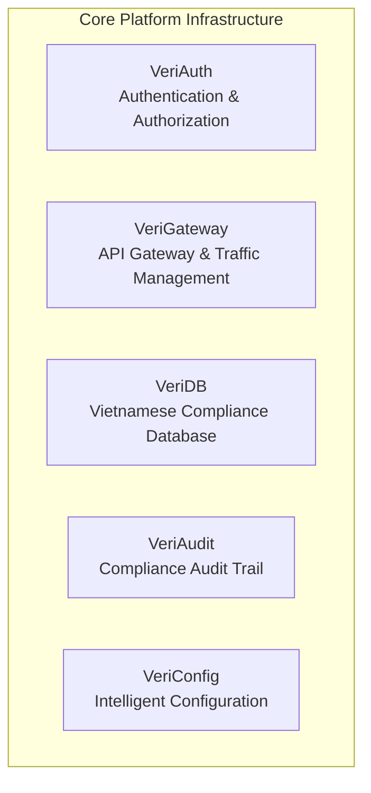
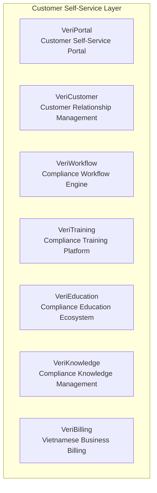
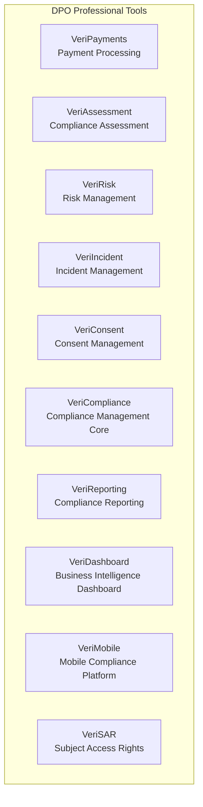
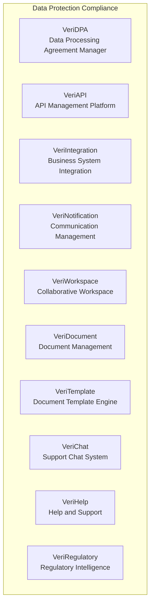
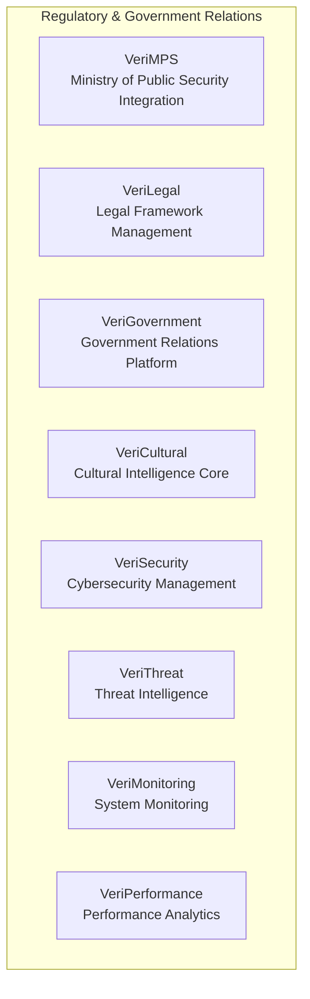
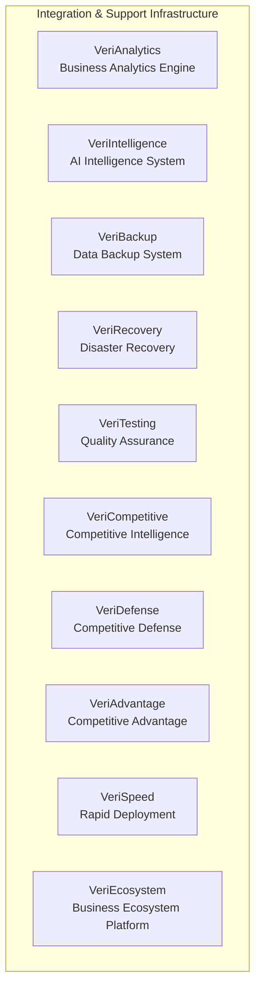
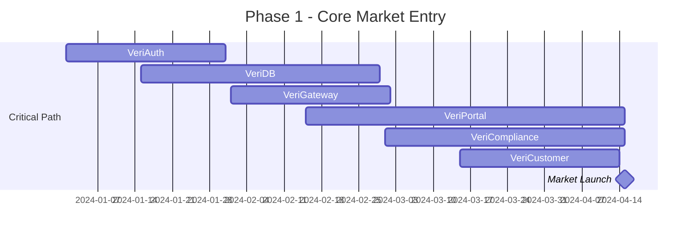
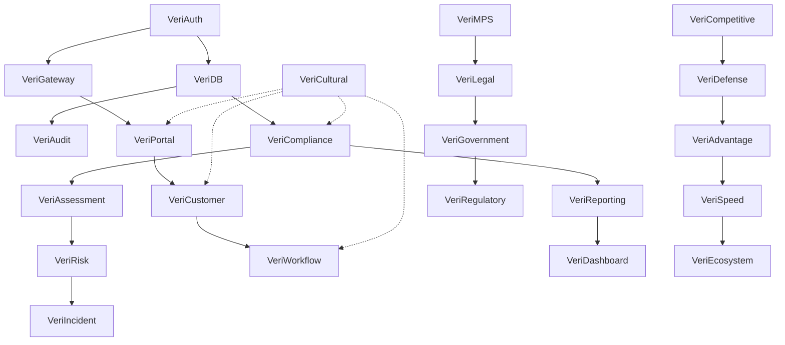

# Verisyntra System Architecture Diagram
## Vietnamese Data Protection Compliance Platform - 50 AI-Enhanced Microservices

### **System Overview**
Verisyntra is a comprehensive Vietnamese data protection compliance platform consisting of 50 AI-enhanced microservices organized into 6 functional categories, designed specifically for Vietnamese market dominance with deep cultural intelligence and regulatory compliance.

---

## **📊 System Categories & Module Grouping**

### **🔐 Category 1: Core Platform Infrastructure (5 Systems)**
**Foundation layer providing essential platform services**

**Key Dependencies:**
- VeriAuth → All Systems (Authentication required)
- VeriGateway → All External Access (Entry point)
- VeriDB → All Data Operations (Storage layer)
- VeriAudit → All Compliance Activities (Audit trail)
- VeriConfig → All Systems (Configuration management)

---

### **👥 Category 2: Customer Self-Service Layer (7 Systems)**
**Vietnamese business self-service compliance management**

**Key Dependencies:**
- VeriPortal → VeriCustomer, VeriWorkflow, VeriTraining
- VeriCustomer → VeriBilling, VeriEducation
- VeriTraining → VeriEducation, VeriKnowledge
- VeriWorkflow → All Compliance Operations

---

### **🛡️ Category 3: DPO Professional Tools (10 Systems)**
**Professional data protection officer capabilities**

**Key Dependencies:**
- VeriCompliance → Central hub for all compliance activities
- VeriAssessment → VeriRisk, VeriCompliance
- VeriReporting → VeriDashboard, VeriCompliance
- VeriIncident → VeriRisk, VeriSecurity

---

### **📋 Category 4: Data Protection Compliance (10 Systems)**
**Comprehensive data protection and document management**

**Key Dependencies:**
- VeriAPI → VeriIntegration, VeriGateway
- VeriDocument → VeriTemplate, VeriWorkspace
- VeriRegulatory → VeriCompliance, VeriMPS
- VeriNotification → VeriChat, VeriCustomer

---

### **🏛️ Category 5: Regulatory & Government Relations (8 Systems)**
**Vietnamese government compliance and cultural intelligence**

**Key Dependencies:**
- VeriCultural → All Systems (Cultural intelligence integration)
- VeriMPS → VeriGovernment, VeriLegal
- VeriSecurity → VeriThreat, VeriMonitoring
- VeriPerformance → VeriMonitoring, VeriAnalytics

---

### **🔧 Category 6: Integration & Support Infrastructure (10 Systems)**
**Analytics, AI, backup, and competitive defense**

**Key Dependencies:**
- VeriIntelligence → All Systems (AI enhancement)
- VeriAnalytics → VeriReporting, VeriDashboard
- VeriBackup → VeriRecovery, VeriDB
- Competitive Defense Systems → Market positioning

---

## **🏗️ Complete System Architecture Diagram**

```mermaid
graph TB
    %% External Layer
    subgraph "External Interface"
        Users[Vietnamese Businesses]
        Government[Vietnamese Government/MPS]
        Partners[Business Partners]
        Competitors[International Competitors]
    end

    %% Entry Points
    subgraph "Entry Layer"
        VeriGateway[🌐 VeriGateway<br/>API Gateway]
        VeriPortal[🖥️ VeriPortal<br/>Customer Portal]
        VeriMobile[📱 VeriMobile<br/>Mobile Platform]
    end

    %% Authentication & Security
    subgraph "Security Layer"
        VeriAuth[🔐 VeriAuth<br/>Authentication]
        VeriSecurity[🛡️ VeriSecurity<br/>Cybersecurity]
        VeriThreat[⚠️ VeriThreat<br/>Threat Intelligence]
    end

    %% Core Intelligence
    subgraph "Intelligence Core"
        VeriCultural[🇻🇳 VeriCultural<br/>Cultural Intelligence]
        VeriIntelligence[🤖 VeriIntelligence<br/>AI Intelligence]
        VeriCompliance[📋 VeriCompliance<br/>Compliance Core]
    end

    %% Customer Management
    subgraph "Customer Layer"
        VeriCustomer[👥 VeriCustomer<br/>Customer Management]
        VeriWorkflow[🔄 VeriWorkflow<br/>Workflow Engine]
        VeriTraining[🎓 VeriTraining<br/>Training Platform]
        VeriEducation[📚 VeriEducation<br/>Education Ecosystem]
    end

    %% Professional Tools
    subgraph "Professional DPO Tools"
        VeriAssessment[📊 VeriAssessment<br/>Assessment Engine]
        VeriRisk[⚠️ VeriRisk<br/>Risk Management]
        VeriIncident[🚨 VeriIncident<br/>Incident Management]
        VeriConsent[✅ VeriConsent<br/>Consent Management]
        VeriSAR[📄 VeriSAR<br/>Subject Access Rights]
    end

    %% Data & Documentation
    subgraph "Data Management Layer"
        VeriDB[🗄️ VeriDB<br/>Database Engine]
        VeriDocument[📑 VeriDocument<br/>Document Management]
        VeriTemplate[📝 VeriTemplate<br/>Template Engine]
        VeriDPA[📋 VeriDPA<br/>DPA Manager]
    end

    %% Integration & APIs
    subgraph "Integration Layer"
        VeriAPI[🔗 VeriAPI<br/>API Management]
        VeriIntegration[🔌 VeriIntegration<br/>System Integration]
        VeriNotification[📢 VeriNotification<br/>Communication]
        VeriWorkspace[🏢 VeriWorkspace<br/>Collaborative Workspace]
    end

    %% Government & Regulatory
    subgraph "Government Relations"
        VeriMPS[🏛️ VeriMPS<br/>MPS Integration]
        VeriLegal[⚖️ VeriLegal<br/>Legal Framework]
        VeriGovernment[🤝 VeriGovernment<br/>Government Relations]
        VeriRegulatory[📜 VeriRegulatory<br/>Regulatory Intelligence]
    end

    %% Analytics & Reporting
    subgraph "Analytics Layer"
        VeriAnalytics[📈 VeriAnalytics<br/>Business Analytics]
        VeriReporting[📊 VeriReporting<br/>Compliance Reporting]
        VeriDashboard[📋 VeriDashboard<br/>BI Dashboard]
        VeriPerformance[⚡ VeriPerformance<br/>Performance Analytics]
    end

    %% Support & Operations
    subgraph "Support Layer"
        VeriChat[💬 VeriChat<br/>Support Chat]
        VeriHelp[❓ VeriHelp<br/>Help System]
        VeriKnowledge[🧠 VeriKnowledge<br/>Knowledge Management]
        VeriBilling[💰 VeriBilling<br/>Billing System]
        VeriPayments[💳 VeriPayments<br/>Payment Processing]
    end

    %% Infrastructure & Operations
    subgraph "Infrastructure Layer"
        VeriConfig[⚙️ VeriConfig<br/>Configuration]
        VeriMonitoring[👁️ VeriMonitoring<br/>System Monitoring]
        VeriBackup[💾 VeriBackup<br/>Data Backup]
        VeriRecovery[🔄 VeriRecovery<br/>Disaster Recovery]
        VeriTesting[🧪 VeriTesting<br/>Quality Assurance]
        VeriAudit[📝 VeriAudit<br/>Audit Trail]
    end

    %% Competitive Defense
    subgraph "Competitive Defense Layer"
        VeriCompetitive[🔍 VeriCompetitive<br/>Competitive Intelligence]
        VeriDefense[🛡️ VeriDefense<br/>Competitive Defense]
        VeriAdvantage[🚀 VeriAdvantage<br/>Competitive Advantage]
        VeriSpeed[⚡ VeriSpeed<br/>Rapid Deployment]
        VeriEcosystem[🌐 VeriEcosystem<br/>Business Ecosystem]
    end

    %% External Connections
    Users --> VeriPortal
    Users --> VeriMobile
    Government --> VeriMPS
    Partners --> VeriAPI
    Competitors -.-> VeriDefense

    %% Entry Layer Connections
    VeriPortal --> VeriAuth
    VeriMobile --> VeriAuth
    VeriGateway --> VeriAuth

    %% Security Layer Connections
    VeriAuth --> VeriCultural
    VeriSecurity --> VeriThreat
    VeriThreat --> VeriIncident

    %% Core Intelligence Connections
    VeriCultural --> VeriCompliance
    VeriIntelligence --> VeriCultural
    VeriCompliance --> VeriAssessment

    %% Customer Layer Connections
    VeriCustomer --> VeriWorkflow
    VeriWorkflow --> VeriTraining
    VeriTraining --> VeriEducation

    %% Professional Tools Connections
    VeriAssessment --> VeriRisk
    VeriRisk --> VeriIncident
    VeriConsent --> VeriSAR
    VeriIncident --> VeriSecurity

    %% Data Management Connections
    VeriDB --> VeriDocument
    VeriDocument --> VeriTemplate
    VeriTemplate --> VeriDPA

    %% Integration Connections
    VeriAPI --> VeriIntegration
    VeriIntegration --> VeriNotification
    VeriNotification --> VeriWorkspace

    %% Government Connections
    VeriMPS --> VeriLegal
    VeriLegal --> VeriGovernment
    VeriGovernment --> VeriRegulatory

    %% Analytics Connections
    VeriAnalytics --> VeriReporting
    VeriReporting --> VeriDashboard
    VeriDashboard --> VeriPerformance

    %% Support Connections
    VeriChat --> VeriHelp
    VeriHelp --> VeriKnowledge
    VeriBilling --> VeriPayments

    %% Infrastructure Connections
    VeriConfig --> VeriMonitoring
    VeriMonitoring --> VeriBackup
    VeriBackup --> VeriRecovery
    VeriTesting --> VeriAudit

    %% Competitive Defense Connections
    VeriCompetitive --> VeriDefense
    VeriDefense --> VeriAdvantage
    VeriAdvantage --> VeriSpeed
    VeriSpeed --> VeriEcosystem

    %% Cross-Layer Critical Connections
    VeriCultural -.-> VeriCustomer
    VeriCultural -.-> VeriTraining
    VeriCultural -.-> VeriMPS
    VeriIntelligence -.-> VeriAnalytics
    VeriCompliance -.-> VeriReporting
    VeriDB -.-> VeriAnalytics
    VeriAudit -.-> VeriCompliance
```

---

## **🚀 Market Testing Priority - Rapid Market Entry Strategy**

### **Phase 1: Core Market Entry (3-6 months)**
**Minimum Viable Product for Vietnamese Market Testing**

**Priority Systems (6 systems):**
1. **🔐 VeriAuth** - Essential authentication foundation
2. **🗄️ VeriDB** - Core data management with Vietnamese patterns
3. **🌐 VeriGateway** - API gateway for external access
4. **🖥️ VeriPortal** - Customer-facing self-service interface
5. **📋 VeriCompliance** - Core compliance engine
6. **👥 VeriCustomer** - Basic customer relationship management

**Market Testing Capabilities:**
- ✅ Vietnamese business onboarding
- ✅ Basic PDPL 2025 compliance assessment
- ✅ Self-service compliance portal
- ✅ Cultural Vietnamese user experience
- ✅ Basic customer management

---

### **Phase 2: Compliance Enhancement (6-9 months)**
**Advanced compliance capabilities for market validation**

**Priority Systems (8 additional systems):**
7. **📊 VeriAssessment** - Compliance assessment engine
8. **⚠️ VeriRisk** - Risk management capabilities
9. **🔄 VeriWorkflow** - Automated compliance workflows
10. **📊 VeriReporting** - Vietnamese regulatory reporting
11. **🇻🇳 VeriCultural** - Deep cultural intelligence integration
12. **📝 VeriAudit** - Comprehensive audit trail
13. **⚙️ VeriConfig** - Intelligent configuration management
14. **🛡️ VeriSecurity** - Cybersecurity management

---

### **Phase 3: Professional DPO Tools (9-12 months)**
**Complete professional DPO capabilities**

**Priority Systems (10 additional systems):**
15. **✅ VeriConsent** - Advanced consent management
16. **📄 VeriSAR** - Subject access rights automation
17. **🚨 VeriIncident** - Incident response management
18. **📑 VeriDocument** - Document lifecycle management
19. **📝 VeriTemplate** - Automated document generation
20. **📋 VeriDPA** - Data processing agreement management
21. **📈 VeriAnalytics** - Advanced business analytics
22. **📋 VeriDashboard** - Business intelligence visualization
23. **🔗 VeriAPI** - Comprehensive API management
24. **🔌 VeriIntegration** - Business system integration

---

### **Phase 4: Government & Ecosystem (12-18 months)**
**Government relations and competitive positioning**

**Priority Systems (12 additional systems):**
25. **🏛️ VeriMPS** - Ministry of Public Security integration
26. **⚖️ VeriLegal** - Legal framework management
27. **🤝 VeriGovernment** - Government relations platform
28. **📜 VeriRegulatory** - Regulatory intelligence
29. **📢 VeriNotification** - Communication management
30. **🎓 VeriTraining** - Compliance training platform
31. **📚 VeriEducation** - Education ecosystem
32. **🧠 VeriKnowledge** - Knowledge management
33. **💬 VeriChat** - Support chat system
34. **❓ VeriHelp** - Help and support system
35. **🏢 VeriWorkspace** - Collaborative workspace
36. **📱 VeriMobile** - Mobile platform optimization

---

### **Phase 5: Competitive Defense & Intelligence (18-24 months)**
**Market dominance and competitive protection**

**Priority Systems (14 remaining systems):**
37. **🤖 VeriIntelligence** - AI intelligence system
38. **⚡ VeriPerformance** - Performance analytics
39. **👁️ VeriMonitoring** - System monitoring
40. **⚠️ VeriThreat** - Threat intelligence
41. **💰 VeriBilling** - Vietnamese billing system
42. **💳 VeriPayments** - Payment processing
43. **💾 VeriBackup** - Data backup system
44. **🔄 VeriRecovery** - Disaster recovery
45. **🧪 VeriTesting** - Quality assurance
46. **🔍 VeriCompetitive** - Competitive intelligence
47. **🛡️ VeriDefense** - Competitive defense
48. **🚀 VeriAdvantage** - Competitive advantage
49. **⚡ VeriSpeed** - Rapid deployment
50. **🌐 VeriEcosystem** - Business ecosystem platform

---

## **📊 Implementation Dependencies & Order**

### **Critical Dependency Chain:**

### **Parallel Development Streams:**

1. **Core Infrastructure Stream** (Foundation)
   - VeriAuth → VeriDB → VeriGateway → VeriAudit

2. **Customer Experience Stream** (Market Entry)
   - VeriPortal → VeriCustomer → VeriWorkflow

3. **Compliance Engine Stream** (Value Delivery)
   - VeriCompliance → VeriAssessment → VeriRisk → VeriIncident

4. **Cultural Intelligence Stream** (Competitive Advantage)
   - VeriCultural → Integration with all customer-facing systems

5. **Government Relations Stream** (Regulatory Positioning)
   - VeriMPS → VeriLegal → VeriGovernment → VeriRegulatory

6. **Competitive Defense Stream** (Market Protection)
   - VeriCompetitive → VeriDefense → VeriAdvantage → VeriSpeed → VeriEcosystem

---

## **🎯 Strategic Implementation Recommendations**

### **1. Market Entry Strategy (Months 1-6)**
- **Focus:** Rapid market entry with core Vietnamese compliance capabilities
- **Key Success Metrics:** 100+ Vietnamese businesses onboarded
- **Competitive Advantage:** Native Vietnamese cultural intelligence vs. international competitors

### **2. Market Validation Strategy (Months 6-12)**
- **Focus:** Professional DPO capabilities validation
- **Key Success Metrics:** 500+ businesses, 95% customer satisfaction
- **Competitive Advantage:** Complete self-service Vietnamese compliance

### **3. Market Dominance Strategy (Months 12-24)**
- **Focus:** Government integration and competitive defense
- **Key Success Metrics:** 2000+ businesses, government partnership, market leadership
- **Competitive Advantage:** Unassailable Vietnamese market position with cultural monopoly

### **4. Risk Mitigation**
- **Technical Risk:** Parallel development streams reduce critical path dependencies
- **Market Risk:** Rapid market entry with MVP validates demand early
- **Competitive Risk:** Cultural intelligence and government relations create barriers to entry
- **Regulatory Risk:** Deep Vietnamese regulatory integration ensures compliance

This architecture provides Verisyntra with a **native Vietnamese competitive advantage** that international competitors cannot replicate without extensive Vietnamese cultural expertise and regulatory understanding, establishing an **unassailable market position** in the Vietnamese data protection compliance market.